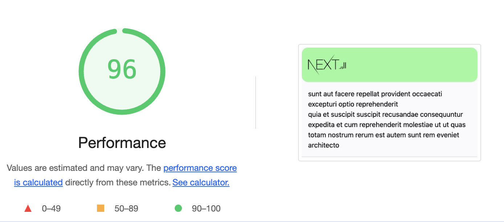

This is a fully working example of Next.js running on Preact instead of React.

This reduces the base JavaScript weight of pages to ~22kB.

### 🚀Blazing fast Next.js starter app with the following:


## Works up to Next.js 15.4.4 ✅
## [You can see a live demo](https://nextjs-starter-gamma.vercel.app/)
- [x] Next.js + Preact >= 10.26.5 = 21kB
- [x] Radix-ui Radix Primitives https://www.radix-ui.com/
- [x] Fastify server dev
- [x] State management with [redux](https://github.com/reactjs/redux)
- [x] [wretch](https://github.com/elbywan/wretch) A tiny wrapper built around fetch with an intuitive syntax
- [x] Prettier task on pre-commit with husky
## Getting started
```
git clone git@github.com:evgenyantipin/nextjs-starter.git my-project
cd my-project
yarn
yarn start
```
