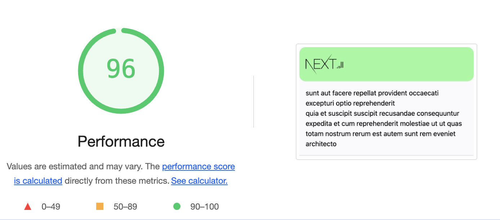

### 🚀Blazing fast Next.js starter app with the following:



## [You can see a live demo](https://nextjs-starter-evgenyantipin.vercel.app/)
- [x] Next.js 15.0.1 ! + Preact = 21kB
- [x] Express.js server
- [x] [Preact optimization enabled](https://github.com/developit/nextjs-preact-demo) reduces the base JavaScript weight of pages to 21kB
- [x] State management with [redux](https://github.com/reactjs/redux)
- [x] [isomorphic-unfetch](https://github.com/developit/unfetch) Tiny 500b
- [x] Scoped and Global SCSS support (.module.scss or .module.sass extension.)
- [x] Sentry error reporting support.
- [x] GZIP enabled with compression middleware
- [x] Prettier task on pre-commit with husky
## Getting started
```
git clone git@github.com:evgenyantipin/next-redux-starter.git my-project
cd my-project
yarn
yarn start
```
